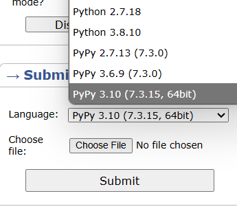

## ACPC Guide for using PyPy on Codeforces

---

As most Codeforces users primarily use C++, many problems on the platform are friendly to C++, with constraints that its raw speed are able to handle. However, Python is significantly slower than C++, and the same logic that works in C++ may not pass in time in Python - segment trees are notorious for this. All ACPC problem have constraints that are passable in PyPy, a fast Python runtime, with the same logic as C++.

Python users are encouraged to submit code with **PyPy**. This is a more optimized Python runtime that, in almost all cases, provides a free speedup to your code. You may also want to [download PyPy to your own system](https://pypy.org/download.html).



One of the most prominent problems with **PyPy** and Codeforces is that Codeforces gives it a **recursion limit** of $1000$ calls. On personal machines, this is easily bypassed using:
```py
import sys
sys.setrecursionlimit(10**5) # Arbitrary limit...
```

**Note:** `sys.setrecursionlimit` does work when submitting using Python, **but NOT PyPy**. However, it is generally encouraged to use PyPy for its speedup.

However, because Codeforces hates Python, this does not work for the platform. If the recursion limit is reached, Codeforces will judge that submission as a **runtime error**. If your code uses recursion and inexplicably results in runtime errors, we encourage you to check that your recursion does not go over the limit of $1000$ calls.

If you must write a recursive function that goes over this amount, we provide a template that you may freely copy-paste to use within your submissions. This template is sourced from [PyRival](https://github.com/cheran-senthil/PyRival/blob/master/pyrival/misc/bootstrap.py), a Python template library for Codeforces. To use it, simply copy the code below and paste it at the start of your solution file. The code is also provided under [recursion.py](https://github.com/JasonFeng365/ACPC-CodeforcesPythonGuide/blob/main/recursion.py) and each of the two sample usage files.

```py
from types import GeneratorType

def bootstrap(f, stack=[]):
	def wrappedfunc(*args, **kwargs):
		if stack:
			return f(*args, **kwargs)
		else:
			to = f(*args, **kwargs)
			while True:
				if type(to) is GeneratorType:
					stack.append(to)
					to = next(to)
				else:
					stack.pop()
					if not stack:
						break
					to = stack[-1].send(to)
			return to
	return wrappedfunc
```

This function makes a custom `@bootstrap` **decorator** that allows you to convert any recursive function into an iterative function, without changing the underlying logic! It works by converting the function into a **generator**. If you use this decorator, you must put the `yield` generator keyword in front of every recursive function, and replace every `return` with `yield`. Also, every call to the function must yield something- even if it is `None`. Examples follow on the next page.

**Note:** on PyPy, this runs about twice as slowly as vanilla recursion; however, every ACPC problem has been tested on Python, and if recursion is required for the solution, PyPy boostrapping will fall within the constraints and should not exceed the time limit.

**Note:** this decorator does not seem to be compatible with `@cache`. You will either have to implement that yourself if you decide to use `@bootstrap`, or have some way to get around the recursion limit of $1000$ to avoid using `@bootstrap`.

Sample code from [sample_printLine.py](https://github.com/JasonFeng365/ACPC-CodeforcesPythonGuide/blob/main/sample_printLine.py)
```py
def printLine(times):
	if times>0:
		print("Hello!")
		printLine(times-1)

# Note: every function call must yield something, even if it is None.
@bootstrap
def bootstrappedPrintLine(times):
	if times>0:
		print("World!")
		yield bootstrappedPrintLine(times-1)	# yield before every recursive call
	yield None	# Must yield something

printLine(3)			# -> Hello! Hello! Hello!
bootstrappedPrintLine(3)	# -> World! World! World!
```

Sample code from [sample_getMax.py](https://github.com/JasonFeng365/ACPC-CodeforcesPythonGuide/blob/main/sample_getMax.py)
```py
arr = [2, 4, 3, 5, 1]

def getMax(i):
	if i==len(arr): return 0
	return max(arr[i], getMax(i+1))

@bootstrap
def bootstrappedGetMax(i):
	if i==len(arr): yield 0
	# Note: yield cannot be inlined.
	nxt = yield bootstrappedGetMax(i+1)
	yield max(arr[i], nxt)

print(getMax(0))		# -> 5
print(bootstrappedGetMax(0))	# -> 5
```

If you have any questions or want to double-check your recursive functions before submitting, feel free to raise your hand to ask for help, and one of the contest staff will come over!
